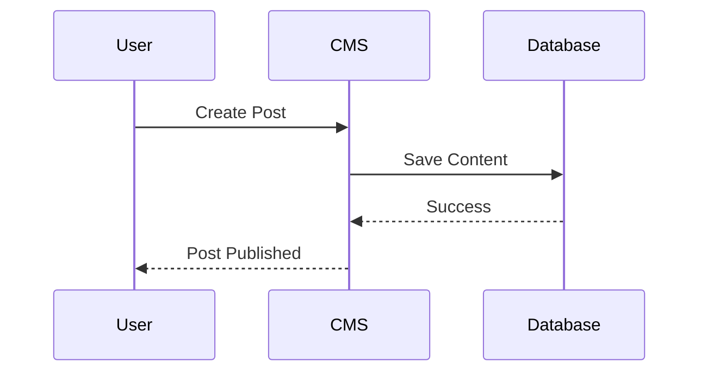
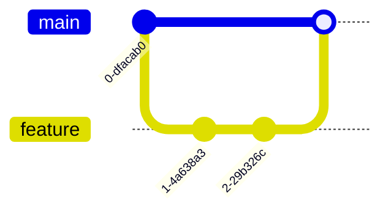

# 🚀 Ultimate CMS Markdown + MDX Feature Test

> A comprehensive content file to test Markdown, GFM, MDX, embeds, tables, callouts, syntax highlighting, shortcodes, task lists, mermaid diagrams, footnotes, and more.

***

## Table of Contents

1. [Introduction](#introduction)
2. [Typography](#typography)
3. [Lists](#lists)
4. [Tables](#tables)
5. [Code Blocks](#code-blocks)
6. [Images & Media](#images--media)
7. [Blockquotes & Callouts](#blockquotes--callouts)
8. [Task Lists](#task-lists)
9. [Footnotes](#footnotes)
10. [Mermaid Diagrams](#mermaid-diagrams)
11. [MDX Components](#mdx-components)
12. [Shortcodes](#shortcodes)
13. [HTML Support](#html-support)
14. [Math Equations](#math-equations)
15. [Collapsible Sections](#collapsible-sections)
16. [Conclusion](#conclusion)

***

# Introduction

Welcome to the **ultimate CMS content stress test**.

This document intentionally mixes:

* Standard Markdown
* GitHub Flavored Markdown (GFM)
* MDX syntax
* HTML blocks
* Shortcodes
* Diagrams
* Code highlighting
* Tables
* Media embeds
* Interactive content

If your CMS can render this properly, your markdown pipeline is probably in good shape.

***

# Typography

## Headings

# H1 Heading

## H2 Heading

### H3 Heading

#### H4 Heading

##### H5 Heading

###### H6 Heading

## Emphasis

This is **bold text**.

This is _italic text_.

This is _**bold italic**_.

This is ~~strikethrough~~ text.

This is ==highlighted== text.

This is `inline code`.

## Keyboard Input ekhane amcjnjcncnvKeyboard input allows users to interact with applications by pressing keys on their keyboards,

Press

## Superscript & Subscript hello

E = mc^2^

H~~2~~O

***

# Lists nvnjnnvjfnvjnfjnv

## Unordered List

* Apple
* Banana
  * Nested Item
  * Another Nested Item
* Orange

## Ordered List

1. Install dependencies
2. Run development server
3. Deploy application

## Mixed List

1. Frontend
   * React
   * Next.js
2. Backend
   * Node.js
   * PostgreSQL

***

# Tables

| Feature                   | Supported               | Notes                    |
| ------------------------- | ----------------------- | ------------------------ |
| Tables                    | ✅ nvjnfnvfjnvfnfvnfjvnj | GitHub flavored markdown |
| MDX ekahne thik korte hbe | ✅                       | JSX rendering            |
| Mermaid                   | ⚠️                      | Depends on parser        |
| Shortcodes                | ✅                       | Hugo / Astro / custom    |

## Alignment Tablevfvfvf

| Left | Center | Right |
| ---- | ------ | ----- |
| A    | B      | C     |
| 10   | 20     | 30    |

***

# Code Blocks vfvfv

## JavaScript nvfnvj

```js
function greet(name) {
  return `Hello, ${name}!`;
}

console.log(greet("CMS Tester"));
```

## TypeScript

```ts
interface User {
  id: number;
  name: string;
}

const user: User = {
  id: 1,
  name: "Shuvo",
};
```

## Bash

```bash
pnpm install
pnpm dev
```

## JSON

```json
{
  "name": "cms-test",
  "version": "1.0.0",
  "private": true
}
```

## Diff vnfvnfnvfnvf vfnjvnf

```diff
- const oldValue = true
+ const newValue = false
```

## HTML

```html
<div className="card">
  <h2>Hello World</h2>
</div>
```

***

# Images & Media Images and media can greatly enhance your content by providing visual interest and supporting your message.

## Markdown Image dcd


## Linked Image

## Video Embed (HTML)

<iframe
  width="560"
  height="315"
  src="https://www.youtube.com/embed/dQw4w9WgXcQ"
  title="YouTube video player"
  frameborder="0"
  allowfullscreen></iframe>

***

# Blockquotes & Callouts vfvf

> This is a standard blockquote.
>
> — Markdown Specification

> \[!NOTE]
> This is a note callout.

> \[!TIP]
> You can use MDX to build interactive blog posts.

> \[!WARNING]
> Some markdown parsers sanitize raw HTML.

> \[!IMPORTANT]
> Always validate user-generated markdown.

***

# Task Lists fvfvf

* [x] Markdown parsing
* [x] Syntax highlighting
* [x] MDX support
* [ ] AI-generated summaries
* [ ] Live collaborative editing

***

# Footnotes

Markdown now supports footnotes.

You can also add multiple references.

[^1]: This is a simple footnote.

[^longnote]: Here’s a longer footnote with multiple lines.

    * It supports lists
    * Code
    * Formatting

***

# Mermaid Diagrams

## Flowchart

```mermaid
flowchart TD
    A[User Opens CMS] --> B[Markdown Parser]
    B --> C[Render HTML]
    C --> D[Display Content] vfvf
```

## Sequence Diagram



## Git Graph



***

# MDX Components&#x20;

Basic JSX

export const Alert = (\{ type = "info", children }) => (

  <div style={{
    padding: '1rem',
    borderRadius: '8px',
    background: '#f4f4f5',
    margin: '1rem 0'
  }}>
    <strong>{type.toUpperCase()}</strong>: {children}
  </div>
)

<Alert type="success">
MDX components are rendering correctly.
</Alert>

## Interactive Component hvbfhb

\<button onClick=\{() => alert('MDX Button Clicked!')}>
Click Me </button>​

## Embedded React Component

<Card title="Example Card">
This content is passed as children.
</Card>

***

# Shortcodes

## Hugo-style Shortcodes







\{\{\< figure
src="https://picsum.photos/800/400"
title="Random Image"
caption="Testing shortcode image rendering"

> }}

## Astro-style Components

<YouTube id="dQw4w9WgXcQ"/>
<Callout type="warning">
Astro component rendering test.
</Callout>

***

# HTML Support

<div className="custom-card">
  <h3>Custom HTML Block</h3>
  <p>
    Testing whether raw HTML rendering is enabled.
  </p>
</div>

<style>
.custom-card {
  padding: 1rem;
  border: 1px solid #ddd;
  border-radius: 8px;
}
</style>

***

# Math Equations njnfvv

Inline math: $a^2 + b^2 = c^2$​

Block math: nvnfjnnvnvjnfnvfj This appears to be a placeholder or sample text, often used when testing mathematical formatting or layout functionality.

$$
\frac{d}{dx}(x^2) = 2x
$$

Matrix:

$$
\begin{bmatrix}
1 & 2 \
3 & 4
\end{bmatrix}
$$

***

# Collapsible Sections

<details>
  <summary>Click to Expand</summary>

Hidden content inside collapsible section.

```js
console.log('Hidden code block'); hvfvv
```

</details>

***

# Emoji Support

😀 😎 🚀 🔥 ✅ ❌ 🎉 📦 🧠 💡bhvhbvfhbbfhvbfhbvhf vnfvnfnv vfnvn

***

# Horizontal Rules

***

***

***

***

# Escaping Characters

_This text is not italic_

# This is not a heading

***

# Autolinks

​https://github.com​​

​https://openai.com​​

​<contact@example.com>​

***

# Definition Lists

Markdown
: A lightweight markup language.

MDX
: Markdown with JSX support.

***

# Nested Block Example

> Quote Level 1
>
> > Quote Level 2
> >
> > ```js
> > console.log('Nested code'); nhnvnf
> > ```

***

# Frontmatter Examples

## YAML Frontmatter

```yaml
---
title: "CMS Markdown Test"
description: "Testing all markdown features"
date: 2026-05-12
tags:
  - markdown
  - mdx
  - cms
published: true
---
```

## TOML Frontmatter

```toml
+++
title = "CMS Test"
author = "Shuvo"
+++
```

***

# API Response Example

```http
HTTP/1.1 200 OK
Content-Type: application/json

{
  "success": true,
  "message": "Content rendered successfully"
}
```

***

# Conclusion jnnvjfnv nvnjv In summary, the findings support our initial hypothesis and highlight areas for future research.

If your CMS successfully renders:

* Markdown
* MDX
* Tables
* Diagrams
* HTML
* Math
* Shortcodes
* Media embeds
* Syntax highlighting
* Footnotes
* Callouts

then your content system is probably production-ready 🎉

***

_Last updated: 2026-05-12_
