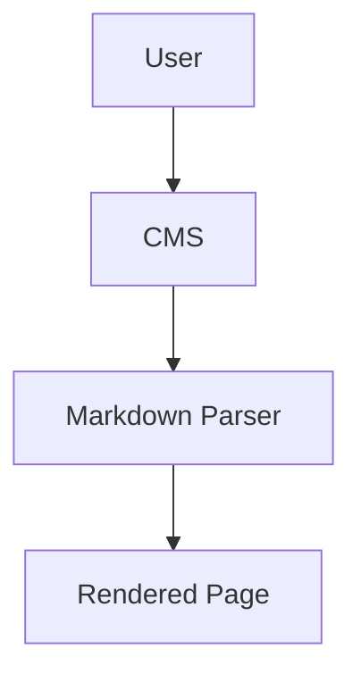
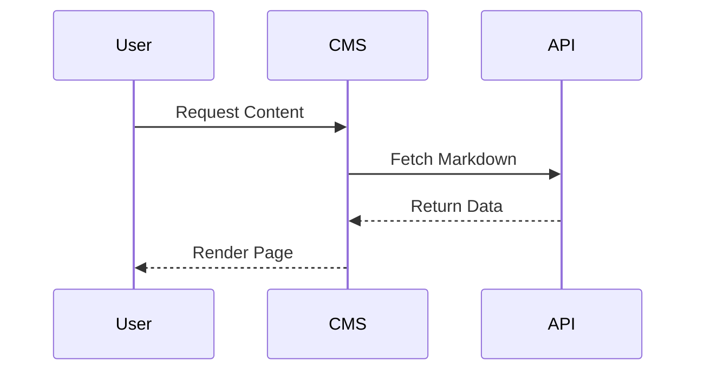

# 🚀 Modern Markdown CMS Demo

Welcome to this **feature-rich markdown document** designed to test your CMS rendering capabilities.

> This content includes:
>
> * Markdown syntax
> * GitHub Flavored Markdown
> * MDX
> * Mermaid diagrams
> * Tables
> * Code blocks
> * Task lists
> * Admonitions
> * Images
> * Embeds
> * Math
> * Footnotes
> * Custom components

***

## Table of Contents

* [Typography](#typography)
* [Lists](#lists)
* [Tables](#tables)
* [Code Blocks](#code-blocks)
* [Blockquotes](#blockquotes)
* [Images](#images)
* [Task Lists](#task-lists)
* [Mermaid Diagrams](#mermaid-diagrams)
* [Math](#math)
* [MDX Components](#mdx-components)
* [Embeds](#embeds)
* [Footnotes](#footnotes)

***

# Typography

## Heading 2

### Heading 3

#### Heading 4

##### Heading 5

###### Heading 6

This is a paragraph with:

* **Bold text**
* _Italic text_
* _**Bold italic**_
* ~~Strikethrough~~
* `inline code`
* \==highlighted text==
* H~~2~~O subscript
* x^2^ superscript

You can also include links:

* [OpenAI](https://openai.com)
* https://github.com

***

# Lists

## Unordered List

* Apple
* Banana
  * Nested item
  * Another nested item
* Orange

## Ordered List

1. First item
2. Second item
3. Third item

## Definition List

Markdown
: Lightweight markup language

MDX
: Markdown + JSX

***

# Tables

| Feature          | Supported | Notes                   |
| ---------------- | --------- | ----------------------- |
| Markdown         | ✅         | Standard syntax         |
| MDX              | ✅         | JSX inside markdown     |
| Mermaid          | ✅         | Diagram rendering       |
| Syntax Highlight | ✅         | Code formatting support |

***

# Code Blocks

## JavaScript

```js
function greet(name) {
  return `Hello, ${name}!`;
}

console.log(greet("Shuvo"));
```

## TypeScript

```ts
interface User {
  id: number;
  name: string;
}

const user: User = {
  id: 1,
  name: "Shuvo",
};
```

## Bash

```bash
pnpm install
pnpm dev
```

## JSON

```json
{
  "name": "markdown-demo",
  "private": true,
  "version": "1.0.0"
}
```

***

# Blockquotes

> Simplicity is the ultimate sophistication.
>
> — Leonardo da Vinci

***

# Images


## Image with Caption

<figure>
  
  <figcaption>Example image caption rendered with HTML.</figcaption>
</figure>

***

# Task Lists

* [x] Markdown support
* [x] MDX support
* [x] Mermaid diagrams
* [ ] Dark mode optimization
* [ ] Search indexing

***

# Horizontal Rule

***

# Collapsible Section

<details>
  <summary>Click to expand</summary>

This content is hidden by default.

You can place:

* Lists
* Code
* Images
* Any markdown content

inside collapsible sections.

</details>

***

# Mermaid Diagrams

## Flowchart



## Sequence Diagram



***

# Math

Inline math: $E = mc^2$​

Block math:

$$
\int_0^\infty e^{-x} dx = 1
$$

***

# MDX Components

## Custom React Component

<MyAlert type="success">
MDX components are working correctly 🎉
</MyAlert>

## JSX Example

<Card title="MDX Card">
This is an embedded JSX component inside markdown.
</Card>

***

# Tabs Example

<Tabs>
<Tab title="React">
```tsx
export default function App() {
  return <h1>Hello React</h1>;
}
```
</Tab>
<Tab title="Vue">
```vue
<template>
  <h1>Hello Vue</h1>
</template>
```
</Tab>
</Tabs>

***

# Embeds

## YouTube Embed

<iframe
  width="100%"
  height="400"
  src="https://www.youtube.com/embed/dQw4w9WgXcQ"
  title="YouTube video player"
  frameborder="0"
  allowfullscreen></iframe>

***

# Keyboard Keys

Press <kbd>CMD</kbd> + <kbd>K</kbd> to open command palette.

***

# Emoji Support

🔥 🚀 🎉 💡 📦 ✅

***

# HTML Support

<div style="padding:16px;border:1px solid #ccc;border-radius:8px;">
  Raw HTML block rendering test.
</div>

***

# Footnotes

Here is a sentence with a footnote.

[^1]: This is the footnote content.

***

# Callouts / Admonitions

> \[!NOTE]
> This is a note callout.

> \[!TIP]
> This is a tip callout.

> \[!WARNING]
> This is a warning callout.

> \[!IMPORTANT]
> Important information goes here.

***

# File Tree Example

```txt
project/
├── content/
│   └── blog/
│       └── markdown-demo.md
├── public/
├── src/
└── package.json
```

***

# API Response Example

```http
HTTP/1.1 200 OK
Content-Type: application/json
```

```json
{
  "success": true,
  "data": {
    "title": "Markdown Demo"
  }
}
```

***

# Conclusion

Your CMS should now be tested against:

* Standard Markdown
* GitHub Flavored Markdown
* MDX
* HTML
* Mermaid
* Math
* Tables
* Code Highlighting
* Embeds
* Interactive Content

Happy building 🚀
